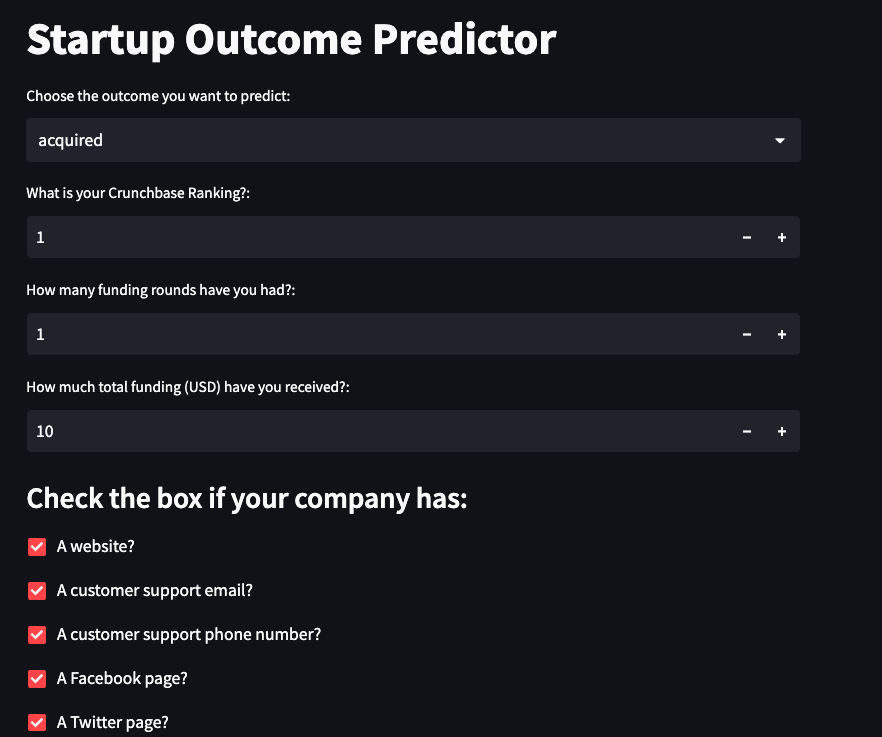
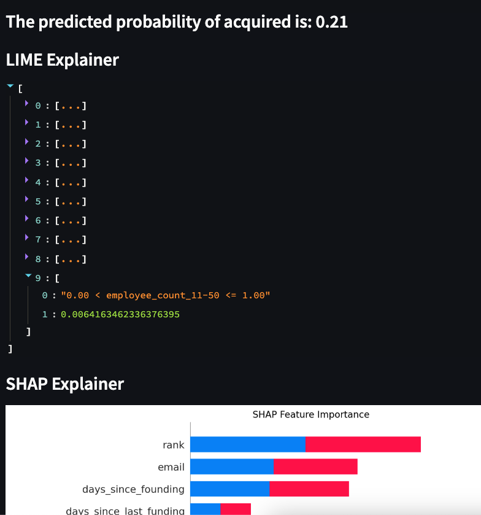

## Table of Contents

- [Installation](#installation)
- [eda.ipynb](#edaipynb)
- [main.py](#mainpy)
  - [Note on Scoring](#note)
- [app.py and its usage](#apppy-and-its-usage)
  - [Photo of Predictor Tool](#photo-of-predictor-tool)
  - [Photo of output](#photo-of-output)
- [Potential Extensions](#potential-extensions)
  - [NLP on short descriptions](#nlp-on-short-descriptions)
  - [Regress on Valuation](#regress-on-valuation)
- [Commentary](#commentary)

## Installation

<a name="installation"></a>

To install the required packages, run the following command:

```bash
pip install -r requirements.txt
```

## eda.ipynb

<a name="edaipynb"></a>

I performed all of my exploratory data analysis as well as data cleaning and feature engineering in a Jupyter notebook for ease of explanation/graph depiction. My process, as well as commentary along the way, is found there.

I spent the majority of my time on this section, and will discuss more in the meeting.

## main.py

<a name="mainpy"></a>

Here is where the model, along with all the relevant evaluation methods, are defined. To play around with the different model outputs, uncomment the code underneath

```
if __name__ == "__main__":
    pass
```

### Note On Scoring

<a name="note"></a>

In the commented code, I implement the accuracy scoring and ROC/AUC scoring to evaluate the model. I do not include these results anywhere else.

## app.py and its usage

<a name="apppy-and-its-usage"></a>

Navigate to the project repository, and run

```
streamlit run app.py
```

This should take you to the Startup Outcome Predictor tool, which lets you choose an outcome that you wish to predict the probability of (acquisition, ipo, closure, continuing operation), input your company data, and recieve a prediction, in the form of a probability, that your company achieve the outcome you chose.

After you press the "predict" button, you will recieve the probability, LIME explanations in the form of a list, and a SHAP plot.

### Photo of Predictor Tool

<a name="photo-of-predictor-tool"></a>



### Photo of output

<a name="photo-of-output"></a>



## Potential Extensions

<a name="potential-extensions"></a>

While implementing my work, I had some ideas for potential extensions to the model I created that, while beyond the scope of the challenge, were interesting to ponder nonetheless:

- ### NLP on short descriptions

  <a name="nlp-on-short-descriptions"></a>
  The `short_description` column was short-form text that described the company. Informally, it seemed like the "elevator pitch" for the company. I think it could be an interesting extension to consider doing some form of NLP on these short descriptions to transform them into features for the model to use.

  - A basic idea would be to identify frequently mentioned words across the successful companies (ideally out of the distribution to reduce overfitting) and perform regex to detect these frequently mentioned words in the production data's `short_description`s. For instance, if successful companies often refer to their products as "solutions", we can add that string detection as a feature and parse other companies short descriptions for other positively associated strings.

- ### Regress on Valuation:
  <a name="regress-on-valuation"></a>
  It would be interesting to train a model to predict `total_funding_usd` based on features.
  - This was actually

## Commentary

<a name="commentary"></a>

I have never been exposed to Graph Neural Networks, and as such, I chose not to explore them in this coding challenge to focus my efforts on making the aspects that I did know as polished as possible. I am confident that I would be able to learn GNN's given the time.

I did not include location codes in my analysis. I originally intended to use country codes, however, I quickly realized that including dummy columns for each of the 116 unique country codes in the dataset would prove to be a difficult thing to reproduce in the UI form input, where each answer _not_ selected by the user would need to be encoded as a 0 -- I would need to specify 115 countries as columns for the dataframe, and was worried that including country code would slow me down greatly and not leave room for other important aspects of the challenge. I did not use state codes because majority of the values were missing. I could have used the region/city pairs, but felt that feature engineering these location strings into numerical values to be used in the model would be beyond the scope of this coding challenge. \*\*If given more time, I would have devised a better way to handle country codes or just hard-coded each non-selected country
